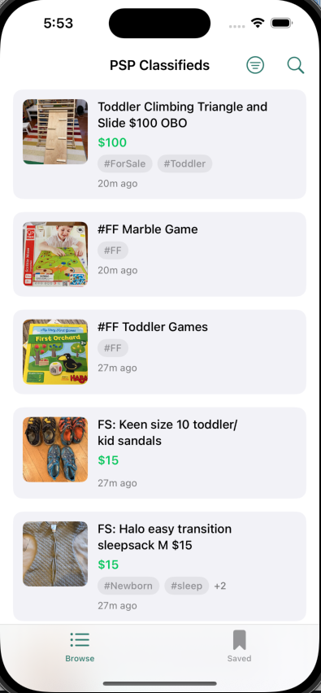

# PSP Classifieds

A mobile app and backend for browsing the [Park Slope Parents](https://www.parkslopeparents.com/) classifieds — For Sale, For Free, and ISO posts from the community.

The backend ingests messages from groups.io on an hourly schedule, stores them in Postgres with full-text search, and serves them through a REST API. The iOS app provides a native browsing experience with filtering, search, saved posts, and authenticated image loading.

## Project Structure

| Directory | Description | Details |
|-----------|-------------|---------|
| [`server/`](server/README.md) | Python backend — FastAPI API + groups.io fetcher | Deployed on Fly.io with Supabase Postgres |
| [`PSPClassifieds/`](PSPClassifieds/README.md) | Native iOS app — SwiftUI | iOS 17+, Xcode project |
